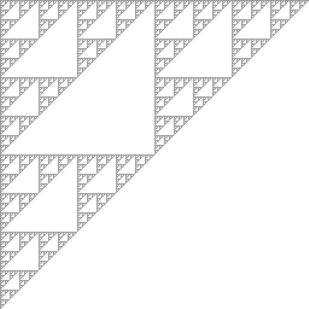

## シルピンスキーガスケットの最も簡単なアルゴリズム
### 概要

- 当ソースコードはクイズ形式になっています。
- judge(x:Int,y:Int)メソッドを実装して、サンプル図のような図形を描画してみてください。  
### 使い方
#### 事前準備
- jdk(1.8)をインストール
- maven(3.0以上)をインストール
#### コンパイル
- mvn compile
#### 実行
- mvn exec:java
#### 実行結果の確認
- work/sample.pngというファイルができあがるはずなので画像ビューワーで確認してください。 
### 終わりに
- 本来の形とは少し違いますが、シルピンスキーガスケットを描画する最も単純なアルゴリズムです。  
といっても、そのほかのアルゴリズムを知らないのですが。。。   
